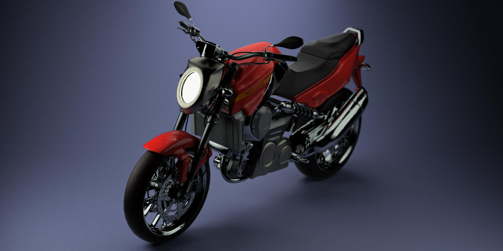

A tiny but powerful raytracer in pure C. It is not as fast as for example blender cycles, but only consists of ~1300 lines of code and is easy to understand (i hope). It can handle basic materials and textures.



# Render your own scene

To render your own scene, open the blender file in the scene folder. Change the materials and models, but make sure to do the following:

- place textures you used inside the scene/textures folder
- use the principled bsdf node for the materials. You can use roughness/color/... textures, but you have to bake them. They get loaded automatically into our raytracer if you do so.
- execute the script i wrote inside Blender or export it as an obj file with materials
- don't have spaces in the material names
- the camera will always be at position x=0, y=0, z=0 and point down (see blender file)
- run the command 
```make run```
to render the scene

TODOS:
- add comments
- better datastructure for faster ray tracing (BVH instead of simple grid)
- importance sampling to reduce noise
- faster tracing using GPU acceleration
- better tone mapping (filmic, ... ?)
- SIMD instructions?
- normal maps